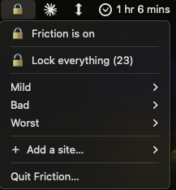
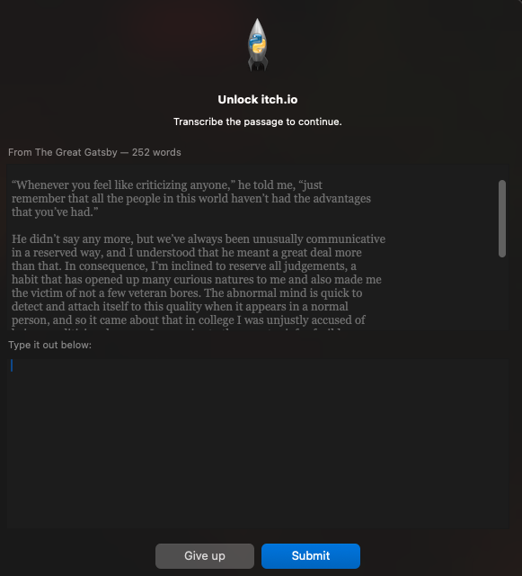
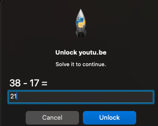
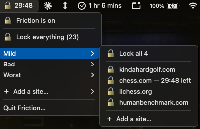

# Friction

A macOS distraction blocker built around the idea that the problem isn't access, it's
*easy* access. Blocked sites and apps aren't unavailable — they just cost something to
reach, and the cost scales with how much of a hole the thing is.

Three tiers. Tier 1 asks you to confirm. Tier 2 makes you do arithmetic. Tier 3 makes
you retype the first page of a novel.

## Opening it

Friction lives in your menu bar and starts automatically when you log in. The icon
tells you where you stand: **🔒** when something is blocked, **🔓** when nothing is,
and **🔓 4:32** counting down when an unlock is running out.

If you quit the panel and want it back, **open Spotlight (⌘-Space) and type
"Friction"** — that reopens it. Blocking never stopped; the panel is only the
control surface.

There is also a command, if you prefer one:

```bash
launchctl start com.friction.ui
```



*The whole control panel. One switch for everything, one row per tier, and a
place to add a site. Quitting it closes the panel, not the blocking.*

## Status

Working and in daily use, but young. The install steps below have been run on a
clean machine; everything else may still move. See [`SPEC.md`](SPEC.md) for the
design and for the platform behaviour it was measured against.

## How it works

Two processes share a state file:

- **`frictiond`** — a background daemon managed by launchd. Owns the schedule and the
  enforcement loop, and restarts itself if killed. Quitting the UI does not stop
  enforcement.
- **Menu bar UI** — the toggle panel and the unlock challenges.

Apps are blocked by listening for macOS launch notifications and quitting anything
blocked the moment it appears — no polling. Websites are blocked by enumerating open
browser tabs via AppleScript every 10 seconds and closing any that match a rule.
Firefox doesn't expose its tabs to AppleScript, so it's treated as a blocked
application rather than a browser.

## Tiers

| | Arms | Releases | Unlock costs |
|---|---|---|---|
| **Tier 3** | 06:00 daily | 21:00 | Confirm, then transcribe a 200–500 word passage |
| **Tier 2** | 06:00 daily | 19:00 | Confirm, then one arithmetic problem |
| **Tier 1** | manual only | manual only | Confirm |



*Tier 3. The passage sits above, you retype it below. Autocorrect, smart quotes
and smart dashes are all switched off, so macOS can't quietly rewrite
Fitzgerald's punctuation — or silently fix your typing before it's marked.*



*Tier 2. One arithmetic problem, after the confirmation. Enough to interrupt a
reflex, not enough to be a project.*

Unlocks are **per-item**: transcribing a page to reach one site doesn't open any
other. Every hole is priced separately.

**What an unlock buys you depends on why the thing was locked.** A lock the
schedule applied is temporary by nature, so beating it buys a short pass. A lock
*you* applied by hand isn't on a clock, and timing it out would just mean redoing
the challenge every half hour all evening:

| Locked by | Kind | You get |
|---|---|---|
| the schedule | anything | 15 min (Tier 2) · 5 min (Tier 3) |
| you, by hand | an app | **no timer** — until you re-lock it, or 06:00 |
| you, by hand | a site, Tier 1 or 2 | your choice: 30 min, or until you re-lock it |
| you, by hand | a site, Tier 3 | always 30 min |

Tier 1 has no schedule, so its unlocks always offer that choice.

Timed passes **expire silently**, with no warning — the tab just closes again.

Turning blocking *on* is always free, at any tier, at any time. Only leaving costs.

Every tier can be locked item by item. Tier 1 also has a single switch for the
whole tier, and one switch at the top of the panel locks everything at once —
but that one costs a passage to undo, so it can't be used to slip past Tier 3.



*Unlocks are per item and visibly timed. `chess.com` has 29:48 left while the
rest of Tier 1 stays locked, and the menu bar counts down so you can watch the
time drain without opening anything.*

## The master toggle

One switch at the top of the panel arms or disarms everything at once.

Turning it *on* is free and immediate.

Turning it *off* has **no puzzle and no delay** — no arithmetic, no transcription,
no waiting. What it does have is witnesses. It shows you exactly what is about to
be sent and to whom, and asks you to confirm:

> This texts Alex, Sam:
> *"Heads up: I just turned off Friction, my distraction blocker. It re-arms in an hour."*
> Everything re-arms in 60 minutes.
> `Send it`  `Never mind`

Once sent, it asks a second time whether you actually saw the message land, and
won't disarm until you say yes. That second step is manual because verifying
delivery would mean reading the Messages database, which needs Full Disk Access —
a permission Friction deliberately doesn't ask for.

Disarming this way is timed; everything re-arms after an hour.

## Requirements

- macOS (Apple Silicon)
- Python 3.11+
- An iMessage-capable Messages account, if you want the master toggle to have teeth

## Install

```bash
git clone <your-repo-url> friction
cd friction
./install.sh
```

`install.sh` creates the virtualenv, copies `config.example.json` to
`config.local.json` if you don't already have one, writes two LaunchAgents to
`~/Library/LaunchAgents` and loads them, builds the launcher app, and finally runs
`friction doctor` to tell you what's still missing.

The two LaunchAgents are the real program: one for the enforcement daemon, one for
the menu bar panel. A LaunchAgent isn't an application — it's a small config file
telling macOS's built-in service manager what to run, to start it at login, and to
restart the daemon if it dies.

The one thing that *is* an app is `~/Applications/Friction.app`, and it does almost
nothing: it asks launchd to start the panel again. It exists only so you can reopen
Friction from Spotlight instead of remembering a command.

## Configuration

`install.sh` creates `config.local.json` for you on first run. To start one by
hand instead:

```bash
cp config.example.json config.local.json
```

`config.local.json` holds your blocklists, unlock durations, and the phone numbers
for your accountability contacts. **It is gitignored and must stay that way.** Don't
put real numbers anywhere else in the repo, and check `git log -p` before making this
repository public.

State lives in `~/Library/Application Support/Friction/state.json` and is not tracked.

## Adding sites

Either from the menu bar — **＋ Add a site…** at the bottom of the panel, or inside
any tier's submenu — then paste a link. Or from the command line:

```bash
./venv/bin/python -m friction block https://reddit.com/r/all --tier tier2
```

Both take a full URL or a bare domain, and both reduce it to the domain to match
on. A leading `www.` is stripped deliberately: rules match downwards, so
`reddit.com` covers `www.reddit.com`, but a rule of `www.reddit.com` would *not*
cover the bare `reddit.com`. It also refuses anything already covered — adding
`old.reddit.com` when `reddit.com` is blocked tells you so instead of quietly
adding a redundant rule.

**One service reached by two names is one lock.** `x.com` and `twitter.com` are
the same place, so they're grouped into a single entry — one padlock in the menu,
one challenge to open, both domains released together. Same for
`youtube.com`/`youtu.be` and `hbomax.com`/`max.com`. In the config a group is
just a list instead of a string:

```json
"sites": [
  ["x.com", "twitter.com"],
  "tiktok.com"
]
```

The first domain is the group's identity, so adding an alias to an entry you've
already unlocked before doesn't void that history.

**Removing a site means editing `config.local.json` by hand.** That asymmetry is
deliberate: getting stricter should be effortless, getting laxer should not.

## Permissions

macOS will not let this work until you grant Automation access by hand, in
System Settings → Privacy & Security → Automation — to control Safari, Chrome, Arc,
and Messages.

Run the built-in check to see exactly what's missing:

```bash
./venv/bin/python -m friction doctor
```

Friction deliberately does **not** need Full Disk Access, and does **not** need
Accessibility permission to quit apps.

## Uninstall

```bash
./uninstall.sh
```

Unloads both LaunchAgents, removes the launcher app, and deletes the state
directory. Your config, your virtualenv, and the repo are left alone.

Automation permissions have to be revoked by hand in System Settings if you want
those gone too.

## Documentation

- [`SPEC.md`](SPEC.md) — the design, and the platform facts measured to support it

## A note on tamper resistance

There isn't any, and that's deliberate. You have the source, the state file, and
`git`. Anyone determined to get around this can get around it in about thirty seconds.
The point isn't to be a lock. It's to convert an unconscious reflex into a decision
you have to make on purpose — and to make the on-purpose version cost enough that you
usually don't bother. If you find yourself wanting to harden it against yourself,
that's worth noticing rather than engineering around.

## Credits

Transcription passages are the openings of *Moby-Dick* (Herman Melville, 1851) and
*The Great Gatsby* (F. Scott Fitzgerald, 1925), both in the US public domain, via
Project Gutenberg.

## License

MIT
